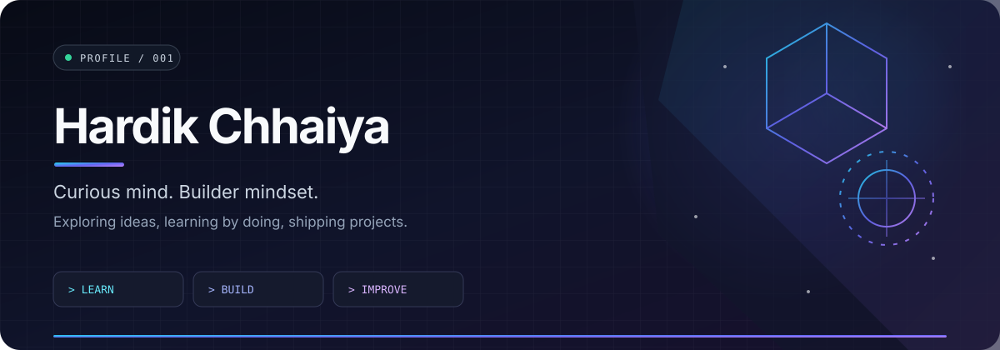

  
   
  
  

##  About

I enjoy exploring how things work, experimenting with ideas, and learning by building. This profile is my little corner of the internet for projects, progress, and whatever I discover next.

<table>
  <tr>
    <td width="50%" valign="top">
      <h3>⌁ The approach</h3>
      
<strong>Learn → Build → Improve</strong>

      
Small iterations, practical experiments, and steady progress.

    </td>
    <td width="50%" valign="top">
      <h3>⌘ Explore</h3>
      
<a href="https://github.com/hardik-starlord?tab=repositories">All repositories ↗</a>

      
<a href="https://github.com/hardik-starlord/Shoes">Shoes project ↗</a>

    </td>
  </tr>
</table>

## GitHub activity

  

  Built with curiosity · Designed in dark mode · Always a work in progress

